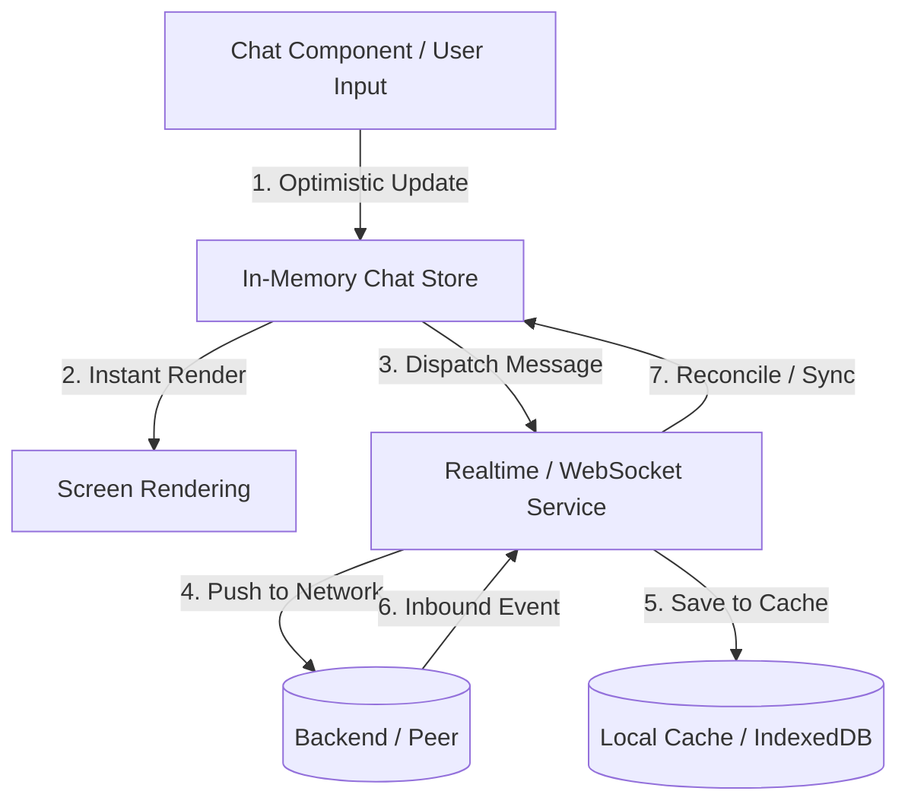

# 🏛️ [아키텍처 명세서] 시스템 및 프론트엔드 아키텍처
> **문서 버전:** v1.0
> **스택:** React 19, TypeScript, Vite, Lucide React
> **상태:** 확정

---

## 1. 기술 스택 (Tech Stack)

| 계층 | 기술 | 선정 이유 |
| :--- | :--- | :--- |
| **Runtime / Library** | React 19 | 최신 React 액션 및 비동기 트랜지션, 렌더링 최적화 활용 |
| **Language** | TypeScript (Strict) | 컴파일 타임 타입 무결성 보장, 런타임 오류 방지 |
| **Bundler / Tooling** | Vite 8.x | 초고속 HMR 및 빌드 성능 최적화 |
| **Iconography** | Lucide React | 미니멀하고 일관된 아이콘 시스템 제공 |
| **State Management** | Context API + Custom Hooks (or Zustand) | 경량성 유지 및 불필요한 번들 오버헤드 차단 |
| **Storage / Cache** | Web Storage API (LocalStorage / IndexedDB) | 클라이언트 캐싱 및 미니멀 로컬 대화 영속성 |

---

## 2. 디렉토리 구조 (Feature-driven Architecture)

기능(Feature) 단위 응집도를 극대화하고 결합도를 낮추는 구조를 준수합니다.

```
src/
├── assets/                  # 정적 리소스 (이미지, 로고, 사운드)
├── components/              # 전역 공통 UI 컴포넌트 (Atoms/Molecules)
│   ├── common/              # Button, Input, Modal, Avatar, Badge 등
│   └── layout/              # AppLayout, NavigationBar, Header 등
├── features/                # 도메인/기능별 모듈
│   ├── chat/                # 대화방 및 메시징
│   │   ├── components/      # MessageBubble, MessageInput, ChatHeader
│   │   ├── hooks/           # useChat, useMessages, useAutoScroll
│   │   └── types/           # Chat/Message 관련 전용 타입
│   ├── chat-list/           # 대화 목록
│   │   ├── components/      # ChatListItem, QuickActionMenu
│   │   └── hooks/           # useChatList, useFilter
│   ├── contacts/            # 친구 추가, QR, 연락처
│   │   ├── components/      # QRCodeModal, ContactCard
│   │   └── hooks/           # useContacts, useShareLink
│   └── settings/            # 설정 및 포커스 모드
│       ├── components/      # FocusToggleSwitch, StorageClearButton
│       └── hooks/           # useUserSettings
├── services/                # 외부 통신 및 스토리지 어댑터
│   ├── storage/             # IndexedDB/LocalStorage 추상화
│   └── realtime/            # WebSocket / Mock Realtime Event Bus
├── stores/                  # 전역 상태 (UserSession, AppSettings, ActiveRoom)
├── types/                   # 도메인 공통 TypeScript 타입 선언
├── styles/                  # 글로벌 CSS 및 디자인 시스템 토큰
└── utils/                   # 날짜 포맷팅, 제너레이터 등 유틸 함수
```

---

## 3. 핵심 데이터 모델 (Domain Entities)

```typescript
// 사용자 및 상태
export type UserStatus = 'online' | 'offline' | 'focus';

export interface User {
  id: string;
  nickname: string;
  avatarUrl?: string;
  status: UserStatus;
  statusMessage?: string;
}

// 메시지 타입 (확장성 고려한 Discriminated Union)
export type MessageType = 'text' | 'image' | 'voice' | 'system';

export interface MessageReaction {
  emoji: string;
  count: number;
  users: string[]; // userIds
}

export interface Message {
  id: string;
  roomId: string;
  senderId: string;
  type: MessageType;
  content: string; // 텍스트 또는 미디어 URL
  reactions: MessageReaction[];
  createdAt: string; // ISO 8601
  isSilent?: boolean; // 포커스/조용한 전송 플래그
  expiresAt?: string; // 클린챗(휘발성) 만료 타임스탬프
}

// 대화방 정보
export interface ChatRoom {
  id: string;
  title: string;
  isGroup: boolean;
  participants: User[];
  lastMessage?: Message;
  unreadCount: number;
  isPinned: boolean;
  isArchived: boolean;
  ephemeralHours?: number; // 0이면 영구, 24/168이면 자동 정리
}
```

---

## 4. 실시간 상태 및 데이터 흐름 (State & Data Flow)



1. **Optimistic UI (낙관적 업데이트):** 사용자가 메시지 전송 버튼을 누르면 서버 응답을 대기하지 않고 즉시 화면에 임시 메시지를 표시합니다.
2. **Event-driven Realtime:** 이벤트 버스 또는 소켓 어댑터를 통해 메시지 인입, 타이핑 인디케이터, 리액션 변화를 처리합니다.
3. **Clean Cache Management:** 만료 시점(`expiresAt`)이 지난 메시지는 백그라운드 워커 또는 앱 부트스트랩 시점에 로컬 스토리지에서 자동 소멸(Purge)됩니다.

---

## 5. 성능 및 렌더링 최적화 원칙
1. **Windowing / Virtual List:** 대화방 메시지 수가 100건을 초과할 경우 가상 스크롤(Virtualization)을 적용하여 DOM 노드 수를 일정하게 유지.
2. **Re-render Isolation:** 메시지 입력창의 타이핑 상태(`input`)가 전체 대화 목록의 리렌더링을 유발하지 않도록 상태 격리.
3. **Zero Layout Shift (CLS 0):** 미디어(이미지) 전송 시 종횡비(Aspect Ratio)를 사전 계산하여 플레이스홀더를 띄워 레이아웃 흔들림 방지.
