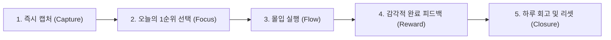

# 📱 [PRD] FocusFlow : 몰입과 성취 중심의 미니멀 Todo List

> **문서 상태**: Approved (기획 완료)  
> **최종 수정일**: 2026-09-19  
> **담당**: AI Pair PM & Dev  

---

## 1. 제품 개요 (Overview)

- **서비스명**: **FocusFlow (포커스플로우)**
- **목표**: 사용자가 느끼는 할 일 관리의 피로감(Task Paralysis)을 해소하고, 즉각적인 등록과 몰입, 완료의 쾌감을 제공하는 미니멀 Todo 웹 애플리케이션.
- **타겟 사용자**: 복잡한 생산성 툴 대신 단순하고 직관적인 실행을 원하는 1030 학생, 취준생, 개발자.
- **핵심 가치**:
  1. **Zero Friction (최소 입력 마찰)**: 1초 만에 생각을 기록
  2. **Peak-End Rule (감각적 보상)**: 완료 순간에 확실한 도파민 피드백 제공
  3. **Single Focus (단일 집중)**: 한 번에 한 가지 일에만 몰입 유도

---

## 2. 사용자 여정 (User Journey)



1. **접속 즉시 입력**: 진입 시 입력창 자동 포커스, 키보드만으로 빠른 등록.
2. **할 일 분리**: 수많은 목록에 압도되지 않도록 'Today'와 'Later' 영역 분리.
3. **몰입 모드**: 필요 시 'Zen Mode'를 켜 다른 요소를 숨기고 단 1개 태스크에 집중.
4. **완료 피드백**: 체크 시 부드러운 취소선 + 햅틱/사운드 + 100% 달성 시 컨페티(폭죽).
5. **부담 없는 리셋**: 자정 이후 미완료 태스크를 질책하지 않고 자연스러운 이월/정리 유도.

---

## 3. 세부 기능 명세 (Feature Specifications)

### 3.1 퀵 인라인 캡처 (Quick Inline Capture)
- 별도 모달이나 팝업 없이 입력창에서 `Enter` 입력 즉시 리스트에 추가.
- 자연어 파싱 지원 (예: `"회의 오늘 15:00 #멋사"` -> 태그/마감시간 자동 분리).

### 3.2 2분할 뷰 (Today vs Later)
- **Today (오늘 할 일)**: 오늘 완료할 핵심 태스크 (최대 3~5개 권장).
- **Later (언젠가 할 일 / 보관함)**: 당장 급하지 않은 태스크들을 모아두는 아카이브. 접기/펼치기 가능.
- 드래그 앤 드롭 또는 버튼 클릭으로 영역 간 자유로운 이동.

### 3.3 단 하나의 집중 모드 (Zen Mode / One-Task Focus)
- 상단의 '오늘의 1순위 포커스 카드'를 클릭하면 활성화.
- 나머지 할 일 목록이 블러 처리되고 오직 선택한 1개의 작업과 타이머(25분 뽀모도로)만 화면에 노출.

### 3.4 마이크로 인터랙션 & 게이미피케이션
- 완료 체크 시 트랜지션 애니메이션 및 진동/효과음.
- 상단 진행률 프로그레스 바 (완료율 시각화).
- 오늘 할 일 전부 달성 시 화면 전체 축하 효과(Confetti).

---

## 4. 화면 설계 (UI Layout)

```text
+--------------------------------------------------+
|  FocusFlow                    2026.09.19 (토)    |
|  진행률: [████████░░░░░] 60% (3/5 완료)            |
+--------------------------------------------------+
|                                                  |
|  [ ⚡ 오늘의 1순위 포커스 카드 ]                   |
|  +--------------------------------------------+  |
|  |  [ ] 동아리 세미나 발표 자료 완성           |  |
|  |      ⏳ 18:00 마감  |  🏷️ #멋사           |  |
|  +--------------------------------------------+  |
|                                                  |
|  📌 Today (오늘 할 일)                            |
|  - [x] 알고리즘 2문제 풀이                        |
|  - [ ] 운동 40분 (러닝)                           |
|  - [ ] 전공 과제 제출                             |
|                                                  |
|  📦 Later (다음에 할 일) [접기/펼치기] (2)        |
|  - [ ] 방 대청소                                 |
|  - [ ] 추천 도서 읽기                             |
|                                                  |
+--------------------------------------------------+
|  [+ 할 일을 입력하세요... (Enter로 저장)       ] |
+--------------------------------------------------+
```

---

## 5. 차별화 포인트 (USP)
1. **Zen Mode**: 할 일 과부하를 원천 차단하는 원터치 포커스 뷰
2. **Guilt-Free UX**: 미완료 항목에 대한 압박감을 덜어주는 부드러운 리셋
3. **Keyboard-First**: `Enter`(추가), `Tab`(분류), `Cmd/Ctrl + D`(완료) 등 단축키 지향

---

## 6. 개발 마일스톤
- **Phase 1 (MVP)**: React 19 기반 컴포넌트 구조, 로컬 스토리지 연동 CRUD, Today/Later 분리
- **Phase 2 (인터랙션)**: 프로그레스 바, 취소선 애니메이션, 컨페티 효과, 단축키 지원
- **Phase 3 (포커스 기능)**: Zen Mode(뽀모도로 연계), 드래그 앤 드롭 정렬
