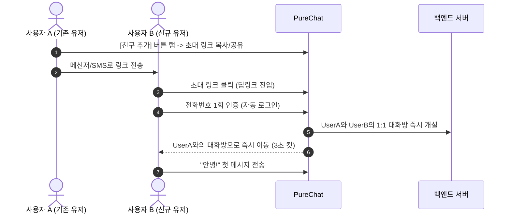

# 📱 [제품 기획서] 미니멀 메신저: PureChat (가칭)
> **"잡음(Noise) 없는 순수한 대화 경험의 회복"**
> **문서 버전:** v1.0
> **상태:** 확정된 MVP 기획안

---

## 1. 프로젝트 개요 & 비전 (Executive Summary)

### 1.1 배경 및 문제 정의
* **메신저 피로도 증가:** 카카오톡, 라인, 텔레그램 등 현대의 메신저들은 쇼핑, 금융, 광고, 오픈채팅, 피드 등 온갖 부가 기능으로 비대화(Bloated)되었습니다.
* **‘대화’ 본질의 퇴색:** 친구에게 메시지 하나 보내려다 광고 배너를 마주치고, 수많은 안 읽은 배지와 마케팅 알림에 인지적 과부하를 겪습니다.
* **읽음 압박과 연결 과잉:** '읽음(1) 표시'로 인한 답장 압박, 24시간 끊임없이 노출되는 상태 정보가 스트레스를 유발합니다.

### 1.2 제품 비전
> **"Zero-Bloat, Zero-Pressure, Pure Connection"**
> 광고 없음, 불필요한 부가기능 없음, 3번의 탭 안에 가장 빠른 대화를 나눌 수 있는 **가장 가볍고 직관적인 미니멀 메신저**.

---

## 2. 타깃 페르소나 & 핵심 UX 원칙

### 2.1 타깃 페르소나
* **Primary (주 사용자):** 복잡한 기능과 피드에 피로감을 느끼며 소수의 친한 친구/연인/가족과 깔끔하게 대화하고 싶은 2030 디지털 디톡스 선호자.
* **Secondary:** 광고나 쓸데없는 알림 없이 빠르고 가볍게 1:1 또는 소규모 프로젝트/스터디 소통을 원하는 사용자.

### 2.2 4대 핵심 UX 원칙
1. **The 3-Tap Rule (3탭 원칙):** 앱 실행부터 메시지 발송까지 3번의 터치를 넘기지 않는다.
2. **Zero-Ad, Zero-Feed (광고·피드 제로):** 배너 광고, 프로모션 탭, 쇼핑 등 대화를 방해하는 요소를 원천 배제한다.
3. **No-Pressure Interaction (부담 없는 상호작용):** 읽음 확인 집착을 줄이고, 상대방의 집중 시간을 존중하는 배려형 인터랙션을 기본 제공한다.
4. **Instant & Lightweight (초경량·초고속):** 앱 용량 최소화, 콜드 스타트 0.5초 이내, 반응성 60fps 유지.

---

## 3. 핵심 기능 정의 (Feature Breakdown)

MVP(최소 기능 제품) 단계에 집중하여 꼭 필요한 기능만 선별했습니다.

| 분류 | 기능명 | 설명 | 우선순위 |
| :--- | :--- | :--- | :---: |
| **온보딩** | 초간단 가입/로그인 | 휴대폰 번호/패스키(Passkey) 기반 OTP 인증. 프로필은 닉네임과 사진만 설정. | **P0 (필수)** |
| **친구/연결** | QR & 인스턴트 링크 추가 | 복잡한 ID 검색 대신 원터치 QR 코드 스캔 및 초대 링크 생성으로 친구 즉시 추가. | **P0 (필수)** |
| **대화 (기본)** | 실시간 텍스트 & 미디어 | 1:1 및 소그룹(최대 10명) 대화, 사진/동영상(고화질/원본 선택), 음성 메모(Push-to-Talk). | **P0 (필수)** |
| **대화 (인터랙션)** | 인라인 이모지 리액션 | 메시지를 길게 누르거나 더블탭하여 간결하게 감정 표현 (대화창 도배 방지). | **P0 (필수)** |
| **대화 관리** | 고정(Pin) & 보관(Archive) | 중요한 대화방 상단 고정, 잠시 안 보는 방 스와이프 숨김. | **P0 (필수)** |
| **차별화 기능** | 포커스 핑 (Focus Ping) | 상대가 '방해 금지' 상태일 때 기본 알림은 무음 처리하되, 긴급 시 1회 울리는 핑. | **P1 (권장)** |
| **차별화 기능** | 클린챗 (Ephemeral Mode) | 대화방별 '24시간/7일 후 자동 정리' 토글 지원 (저장공간 및 프라이버시 보호). | **P1 (권장)** |
| **차별화 기능** | 조용한 읽음 (Gentle Read) | 읽음 여부를 강박적으로 표시하지 않고, '상대방 활동 중' 정도의 부드러운 상태 전달. | **P2 (차후)** |

---

## 4. 정보 구조 (IA) 및 사용자 플로우

### 4.1 앱 정보 구조 (2-Tab 간결 구조)
하단 네비게이션을 복잡하게 5개씩 두지 않고, 오직 **[대화]**와 **[설정/프로필]** 2개 탭 또는 단일 뷰 구조를 지향합니다.

```mermaid
graph TD
    App[PureChat App] --> Tab1[대화 탭 (Home)]
    App --> Tab2[설정 탭 (Profile/Settings)]

    Tab1 --> ChatList[대화방 목록]
    ChatList --> ChatRoom[대화방 내부]
    ChatList --> NewChatModal[새 대화 / 친구 추가 모달]

    ChatRoom --> MediaViewer[사진/미디어 뷰어]
    ChatRoom --> RoomSettings[대화방 설정 (알림/클린챗)]

    NewChatModal --> QRScan[QR 스캔 / 링크 공유]
    NewChatModal --> ContactSelect[친구 선택]

    Tab2 --> FocusToggle[포커스 모드 토글]
    Tab2 --> PrivacySettings[보안 / 프라이버시]
    Tab2 --> StorageManagement[저장공간 원터치 비우기]
```

### 4.2 핵심 사용자 플로우 (초대부터 첫 메시지까지)



---

## 5. 화면 구성 및 UI/UX 와이어프레임

디자인 언어는 **스위스 미니멀리즘(Swiss Minimalist Typography)**과 **여백(Negative Space)** 중심의 현대적 플랫 디자인을 채택합니다.

### 5.1 화면 1: 대화 목록 (Home - Chat List)
* **상단:** 심플한 앱 타이틀, 우측에 `[포커스 모드 토글]`, `[+] 새 대화`
* **중앙:** 여백이 넉넉한 대화방 리스트 (프로필, 이름, 마지막 메시지, 시간, 뱃지)
* **스와이프 제스처:**
  * 오른쪽 스와이프: 읽음/안읽음 토글
  * 왼쪽 스와이프: 상단 고정(Pin) 또는 보관(Archive)

```text
┌──────────────────────────────────────────┐
│  PureChat                 🌙 [●]  [ + ]  │  <-- Focus 토글 / 새 대화
├──────────────────────────────────────────┤
│                                          │
│  📌 [민수]                                │
│     오늘 저녁 7시 강남역 어때?     14:20 │
│                                          │
│  ── [소규모 개발팀 (3)]                  │
│     지선: 배포 완료했습니다!       13:05  │
│                                          │
│  ── [수진]                               │
│     📷 사진 1장을 보냈습니다.      어제  │
│                                          │
│  ── [가족방]                             │
│     엄마: 주말에밥 먹자          3일전  │
│                                          │
├──────────────────────────────────────────┤
│  [  💬 대화  ]          [  ⚙️ 설정  ]    │  <-- 미니멀 2버튼 하단바
└──────────────────────────────────────────┘
```

### 5.2 화면 2: 대화방 (Chat Room)
* **상단바:** 상대방 이름, 현재 상태(온라인 / 🌙 방해금지 중), 대화방 설정(`...`)
* **메시지 버블:** 불필요한 말풍선 꼬리표 제거, 여백 중심.
* **하단 입력창:**
  * `[+]` 미디어 전송
  * 텍스트 인풋 필드
  * `[마이크]` 원터치 음성 메시지 (입력 중일 땐 `[전송]` 화살표로 매끄럽게 전환)

```text
┌──────────────────────────────────────────┐
│ <  [민수] 🌙 (포커스 모드)         [ ··· ] │
├──────────────────────────────────────────┤
│                                          │
│                - 오늘 -                  │
│                                          │
│    [민수]                                │
│    ┌──────────────────────────────┐      │
│    │ 오늘 저녁 7시 강남역 어때?   │ 14:15│
│    └──────────────────────────────┘      │
│      ❤️ 1                                │
│                                          │
│                        ┌──────────────┐  │
│                   14:18│ 좋아! 그때 봐│  │
│                        └──────────────┘  │
│                                          │
├──────────────────────────────────────────┤
│ [ + ]  메시지를 입력하세요...     [ 🚀 ] │
└──────────────────────────────────────────┘
```

### 5.3 화면 3: 새 대화 / 친구 추가 모달 (Quick Add)
* 스크롤 없이 **단일 팝업 시트**로 해결.
* 내 QR 코드 표시 + 상대 QR 스캐너 + 인스턴트 초대 링크 복사.

```text
┌──────────────────────────────────────────┐
│                 새 대화 시작             │
│                                          │
│          ┌──────────────────┐            │
│          │  [내 QR 코드]    │            │
│          │    ▒▒▒▒▒▒▒▒▒     │            │
│          │    ▒▒  ▒▒  ▒▒     │            │
│          │    ▒▒▒▒▒▒▒▒▒     │            │
│          └──────────────────┘            │
│        "상대방에게 보여주세요"           │
│                                          │
│  [ 📷 상대방 QR 스캔 ]                   │
│  [ 🔗 대화 초대 링크 복사 ]              │
│                                          │
│  연락처에서 찾기                         │
│  🔍 이름 또는 번호 검색...               │
└──────────────────────────────────────────┘
```

---

## 6. 핵심 차별화 포인트 (The Unfair Advantage)

기존 빅테크 메신저가 비즈니스 모델(광고, 커머스) 때문에 **절대 따라 할 수 없는 영역**을 공략합니다.

```
1. 디톡스 & 배려 UX (Focus & Gentle UX)
   - "포커스 모드": 내가 휴식/업무 중일 때 상대방 화면에 부드러운 달(🌙) 아이콘 노출.
   - "조용한 전송": 늦은 밤 상대방에게 소리/진동 없이 조용히 도착하는 슬로우 메시지 전송.

2. 제로 트래시 (Zero-Trash Storage)
   - 톡서랍, 캐시 등 수 기가바이트씩 쌓이는 메신저 용량 문제를 원천 차단.
   - '클린챗' 옵션 활성화 시 7일 후 대용량 미디어 자동 만료, 원터치 로컬 캐시 클리어.

3. 무광고 & 무추적 (Privacy & Cleanliness)
   - 대화 데이터 마이닝 제로, 광고 인벤토리 제로.
   - 단말 간 암호화(E2EE)를 기본 적용하여 가장 안전하고 깨끗한 사적 대화 보장.
```

---

## 7. MVP 개발 로드맵 및 성공 측정 지표 (KPI)

### 7.1 마일스톤 (총 8주 플랜)
```
[Sprint 1-2] 인프라 & 핵심 인증 (Weeks 1~2)
  - OTP 무비밀번호 로그인
  - DB 스키마 설계 및 암호화 키 생성 로직 구축

[Sprint 3-4] 실시간 대화 & 미디어 (Weeks 3~4)
  - 1:1 웹소켓 실시간 대화
  - 사진/동영상 업로드 및 압축 전송
  - 푸시 알림 (FCM / APNs)

[Sprint 5-6] UI 고도화 & 차별화 기능 (Weeks 5~6)
  - 미니멀 디자인 시스템 적용 (다크/라이트 모드)
  - 포커스 모드 & 조용한 전송
  - QR 및 딥링크 초대 시스템

[Sprint 7-8] 안정화 & 스토어 출시 (Weeks 7~8)
  - 오프라인 큐 및 재전송 로직
  - 배터리 및 메모리 누수 테스트
  - 출시 및 사용자 온보딩 추적
```

### 7.2 성공 측정 지표 (KPI)
1. **Time-to-First-Message (TTFM):** 앱 최초 실행 후 첫 메시지 발송까지 걸리는 시간 (**목표: 30초 이내**)
2. **D7 / D30 잔존율 (Retention):** 7일/30일 후에도 소수 지인과 계속 대화하는 비율 (**목표: D30 > 45%**)
3. **App Crash Free Rate:** 무결성에 가까운 안정성 (**목표: 99.8% 이상**)
4. **App Launch Speed:** 콜드 스타트 시 대화방 목록 렌더링 시간 (**목표: 500ms 미만**)
