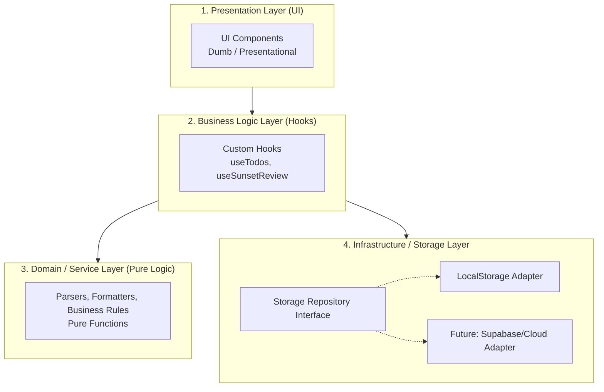

# 🏗️ [규칙] 프로젝트 및 시스템 아키텍처 가이드라인

이 문서는 FlowDo 애플리케이션의 지속 가능한 확장성, 유지보수성, 테스트 용이성을 보장하기 위한 **프로젝트 및 소프트웨어 아키텍처 설계 원칙**을 정의합니다.

---

## 1. 핵심 아키텍처 원칙 (Core Architectural Principles)

### 1.1 계층화 아키텍처 (Layered Clean Architecture)
관심사의 분리(Separation of Concerns)를 위해 코드를 명확한 4계층으로 격리합니다:



1. **Presentation Layer (`src/components/`)**:
   - 순수 UI 렌더링 및 사용자 입력 이벤트 전달에만 집중합니다.
   - 복잡한 상태 변이 로직이나 스토리지 I/O를 직접 다루지 않습니다.
2. **Business Logic Layer (`src/hooks/`)**:
   - 애플리케이션의 상태와 비즈니스 워크플로우를 조율합니다.
   - 컴포넌트와 도메인/스토리지 사이의 중계자 역할을 담당합니다.
3. **Domain & Service Layer (`src/services/`, `src/utils/`)**:
   - 프레임워크나 UI에 의존성이 없는 순수 함수(Pure Functions)로 구성됩니다.
   - 자연어 파싱, 날짜 계산, Rule of 3 검증 로직 등이 여기에 속합니다.
4. **Infrastructure Layer (`src/storage/`)**:
   - 데이터의 영속성(LocalStorage, IndexedDB, 향후 클라우드 DB)을 추상화합니다.

---

## 2. 저장소 추상화 (Repository Pattern)

UI나 비즈니스 로직이 특정 스토리지 구현(`localStorage` 등)에 직접 결합되지 않도록 **저장소 인터페이스**를 거쳐 접근합니다.

```typescript
// src/types/storage.ts
export interface TodoRepository {
  getTodos(): Promise<Todo[]>;
  saveTodos(todos: Todo[]): Promise<void>;
  clear(): Promise<void>;
}
```

* **이점:** 향후 LocalStorage에서 Supabase, Firebase, IndexedDB 등으로 스토리지를 전환하더라도 UI와 Hook 코드는 단 한 줄도 수정할 필요가 없습니다.

---

## 3. 상태 관리 원칙 (State Management)

1. **단방향 데이터 흐름 (Unidirectional Data Flow):**
   - 상태(State)는 항상 상위에서 하위로 흐르고, 액션(Action/Event)은 하위에서 상위로 전달됩니다.
2. **불변성 보장 (Immutability):**
   - 모든 상태 변경은 객체/배열의 원본을 수정하지 않고 새로운 참조를 생성합니다.
3. **낙관적 업데이트 (Optimistic UI Update):**
   - 사용자 액션(예: 할 일 체크) 발생 시 스토리지 저장 완료를 기다리지 않고 UI 상태를 즉시 갱신하여 0ms 반응성을 달성합니다.
4. **글로벌 vs 로컬 상태 기준:**
   - 모달 열림/닫힘, 인풋 입력값 등 특정 뷰 전용 상태 ➔ `useState`
   - Todo 목록, 전역 필터, 사용자 테마 설정 ➔ Custom Hook 기반 Context 또는 최상위 상태 공유

---

## 4. 데이터 모델링 및 스키마 (Data Modeling)

```typescript
// src/types/todo.ts

export type Priority = 'high' | 'normal';
export type TodoStatus = 'today' | 'inbox' | 'completed' | 'archived';

export interface Todo {
  id: string;              // crypto.randomUUID()
  title: string;           // 할 일 제목
  status: TodoStatus;      // 상태 (오늘/보관함/완료/아카이브)
  priority: Priority;      // 중요도 (Rule of 3 판정 기준)
  dueDate?: string;        // ISO 8601 string (자연어 파싱 결과)
  completedAt?: string;    // 완료된 시각
  createdAt: string;       // 생성 시각
  updatedAt: string;       // 수정 시각
}

export interface SunsetSummary {
  date: string;            // YYYY-MM-DD
  totalToday: number;      // 오늘 목표 개수
  completedCount: number;  // 완료한 개수
  deferredCount: number;   // 내일로 넘긴 개수
}
```

---

## 5. 복구성 및 에러 핸들링 (Resilience & Error Handling)

1. **Storage Quota & Fallback:**
   - LocalStorage 용량 초과 또는 시크릿 모드 차단 시 메모리 캐시(In-Memory Fallback)로 부드럽게 전환하여 앱 중단을 방지합니다.
2. **데이터 마이그레이션 전략:**
   - 스키마 변경에 대비하여 저장소 데이터에 `schemaVersion`을 명시하고, 초기화 시 마이그레이션 함수를 실행합니다.
3. **React Error Boundary:**
   - 예상치 못한 렌더링 에러 발생 시 화이트아웃 대신 친절한 에러 복구 UI(초기화 또는 새로고침 버튼)를 제공합니다.
