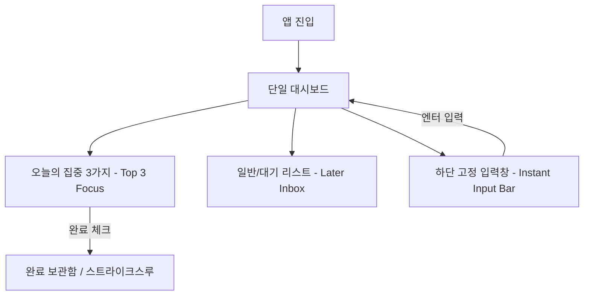

# [기획안] 초간결 사용자 중심 Todo List 앱: FocusFlow

> 본 문서는 'FocusFlow' 투두리스트 애플리케이션의 상세 제품 기획 및 UX/UI 설계 사양서입니다.

---

## 1. 프로젝트 개요 (Overview)
* **서비스명**: FocusFlow (가칭)
* **목표**: 사용자가 '할 일을 관리하는 데 드는 피로(Management Overhead)'를 제거하고, **1초 만에 기록하고 한 번의 제스처로 완료하는 초간결 무마찰(Frictionless) 경험**을 제공합니다.
* **타깃 사용자**: 복잡한 일정 관리 툴(태그, 폴더, 중첩 하위할일 등)에 피로감을 느끼고 미니멀하고 직관적인 투두 앱을 원하는 사용자.

---

## 2. 핵심 UX 원칙 (Core UX Principles)
1. **Zero-Thinking Capture**: 앱 진입 즉시 생각의 흐름을 방해하지 않고 바로 입력 가능한 상태를 유지합니다.
2. **Anti-Cognitive Overload**: 화면에 처리할 일이 쏟아져 나오는 인지적 과부하를 방지하기 위해 '오늘의 핵심 할 일'을 3~5개 이내로 집중(Top-Focus) 배치합니다.
3. **Guilt-Free Workflow**: 완료하지 못한 작업에 대해 시각적 압박(붉은 경고, 페널티) 대신, 다음 날 자연스럽게 이월(Rollover)하도록 유도합니다.

---

## 3. 기능 요구사항 (Functional Requirements)

| 분류 | 기능명 | 상세 사양 | UX/인터랙션 고려사항 |
| :--- | :--- | :--- | :--- |
| **생성** | 빠른 태스크 추가 | 하단 고정 인풋창에서 입력 후 `Enter` 또는 추가 버튼으로 등록 | 등록 즉시 리스트 상단으로 부드러운 페이드/슬라이드 인 |
| **완료** | 원터치 완료 처리 | 체크박스 클릭 또는 항목 터치로 완료/미완료 토글 | 완료 시 햅틱 피드백 + 취소선(Strike-through) 애니메이션 |
| **우선순위**| Today's Top 3 (집중 모드) | 오늘 반드시 집중할 태스크 최대 3개를 상단 집중 영역에 배치 | 시각적 하이라이트(폰트 두께, 강조 테두리 등) |
| **정렬/관리**| 드래그 앤 드롭 정렬 | 우선순위 및 순서 변경 | 길게 눌러 드래그 시 반응형 인디케이터 표시 |
| **보관** | 완료된 목록 보관함 | 완료된 항목은 화면 하단 보관함 영역으로 분리/접기 가능 | 완료 개수 카운팅을 통해 성취감 제공 |
| **저장** | Local-First 스토리지 | 별도 회원가입 없이 브라우저 `localStorage`에 자동 동기화 | 오프라인 지원 및 즉시 로딩 |

---

## 4. 화면 구성 및 사용자 플로우 (UI/UX Layout)

### 사용자 플로우

### 화면 레이아웃 와이어프레임
1. **헤더 영역 (Header & Daily Progress)**
   * 오늘 날짜 (예: `2026. 09. 19. 화요일`)
   * 당일 완료율 인디케이터 (예: `오늘 2 / 5 완료 ✨`)
2. **메인 컨텐츠 영역 (Task Feed)**
   * **🔥 Focus Now (최대 3개)**: 집중 영역, 눈에 띄는 카드 스타일.
   * **📋 Later / Inbox**: 바로 하지 않아도 되는 태스크 리스트 (아코디언 토글 가능).
3. **하단 고정 영역 (Bottom Input & Filters)**
   * 화면 최하단 플로팅 인풋 바 (`+ 할 일을 입력하세요...`)
   * 필터 탭 (전체 / 오늘 / 완료됨)

---

## 5. 차별화 포인트 (Differentiators)
1. **감각적 보상 (Micro-Interactions)**: 완료 시 가벼운 파티클 애니메이션과 인터랙션으로 성취감 극대화.
2. **Gentle Roll-over**: 미완료 항목에 대한 압박 대신, 아침 리셋 플로우 지원.
3. **Zero-Loading, Zero-Account**: 접속 즉시 0.1초 만에 동작하는 초경량 클라이언트.

---

## 6. 기술 구현 스택 제안
* **Frontend**: React 19 + TypeScript + Vite
* **Styling**: Tailwind CSS 또는 모던 CSS Module
* **Icons**: `lucide-react`
* **State & Storage**: React State + `localStorage`
